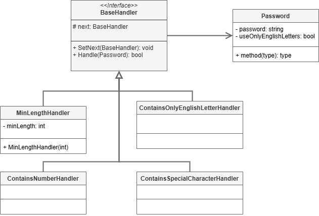

 # Chain of Responsibility Pattern

This project demonstrates the implementation of the Chain of Responsibility design pattern within the `src` folder. 
The Chain of Responsibility design pattern is a behavioral design pattern that allows for a chain of objects to receive and handle a request. The pattern is used when a client wants to delegate a request to multiple objects that can handle it.

## UML Class Diagram

The UML class diagram for the Chain of Responsibility pattern is shown below:

## Source Code

The `src` folder contains the implementation of the Chain of Responsibility pattern. The key components include:

- **BaseHandler**: An abstract class or interface that defines the interface for the concrete handlers. Abstraction used by the client.
- **MinLenthHandler**, **ContainsNumberHandler**, **ContainsOnlyEnglishLettersHandler**, **ContainsSpecialCharacterHandler**: Concrete implementations of the BaseHandler, these are the pieces of the chain.
- **Password**: A class that represents the request to be processed.

Explore the `src` folder to see how each of these components has been implemented.
