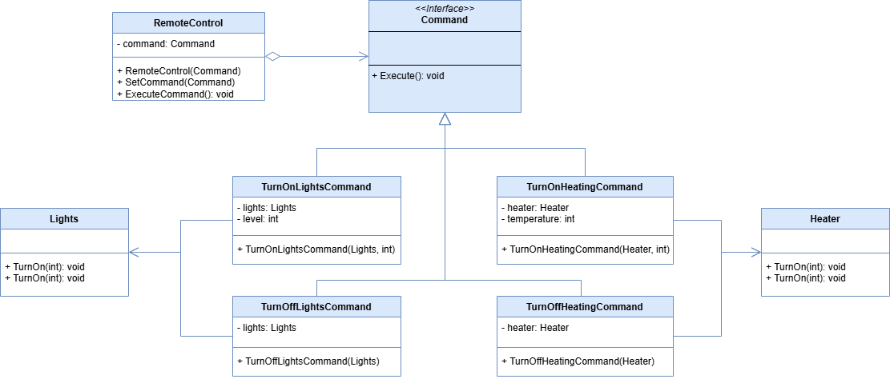

 # Command Pattern

This project demonstrates the implementation of the Command design pattern within the `src` folder. 
The Command design pattern is a behavioral design pattern that allows for the encapsulation of actions or requests as objects. These objects can be passed to other objects to be executed at a later time. The pattern is used when a client wants to delegate a request to multiple objects that can handle it.

## UML Class Diagram

The UML class diagram for the Command pattern is shown below:   

## Source Code

The `src` folder contains the implementation of the Command pattern. The key components include:

- **Command**: An abstract class or interface that defines the interface for the target class.
- **Light**, **Heater**: Concrete implementations, service objects.
- **TurnOnLightsCommand**, **TurnOffLightsCommand**, **TurnOnHeatingCommand**, **TurnOffHeatingCommand**: Concrete implementations of the Command abstract base class.
- **RemoteControl**: A class that represents the invoker for the Command design pattern.

Explore the `src` folder to see how each of these components has been implemented.
