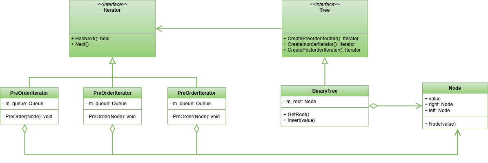

 # Iterator Pattern

This project demonstrates the implementation of the Iterator design pattern within the `src` folder. 
The Iterator design pattern is a behavioral design pattern that lets you traverse elements of a collection without exposing its underlying representation (list, stack, tree, etc.).

## UML Class Diagram

The UML class diagram for the Iterator pattern is shown below:

## Source Code

The `src` folder contains the implementation of the Iterator pattern. The key components include:

- **Iterator**: An abstract class or interface that defines the interface for the concrete iterators. Abstraction used by the client.
- **Tree**: An abstract class or interface that defines the interface for the target class. Abstraction used by the client.
- **BinaryTree**: A concrete implementation of the Tree interface that represents the Concrete class of the Iterator design pattern.
- **PreOrderIterator**, **InOrderIterator**, **PostOrderIterator**: Concrete implementations of the Iterator abstract base class.

Explore the `src` folder to see how each of these components has been implemented.
