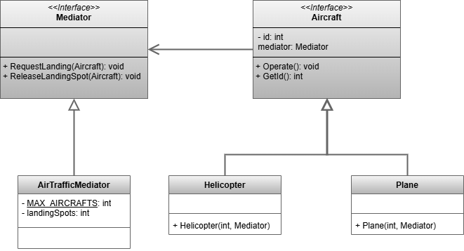

 # Mediator Pattern

This project demonstrates the implementation of the Mediator design pattern within the `src` folder. 
The Iterator design pattern is a behavioral design pattern that reduces coupling between components of a program by making them communicate indirectly, through a special mediator object.

## UML Class Diagram

The UML class diagram for the Mediator pattern is shown below:

## Source Code

The `src` folder contains the implementation of the Mediator pattern. The key components include:

- **Mediator**: An abstract class or interface that defines the interface for the concrete mediators. Abstraction used by the client.
- **AirTrafficMediator**: A concrete implementation of the Mediator abstract base class.
- **Plane**, **Helicopter**: Concrete classes that implement the Aircraft abstract base class. Services.

Explore the `src` folder to see how each of these components has been implemented.
