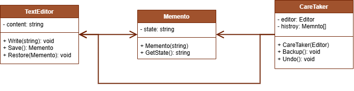

 # Mememnto Pattern

This project demonstrates the implementation of the Mememnto design pattern within the `src` folder. 
The Iterator design pattern is a behavioral design pattern that lets you save and restore the previous state of an object without revealing the details of its implementation.

## UML Class Diagram

The UML class diagram for the Mememnto pattern is shown below:

## Source Code

The `src` folder contains the implementation of the Mememnto pattern. The key components include:

- **TextEditor**: Stands for the originator class.
- **Memento**: The class that stores the state of the TextEditor class.
- **Caretaker**: A class that manages the creation and storage of mementos.

Explore the `src` folder to see how each of these components has been implemented.
