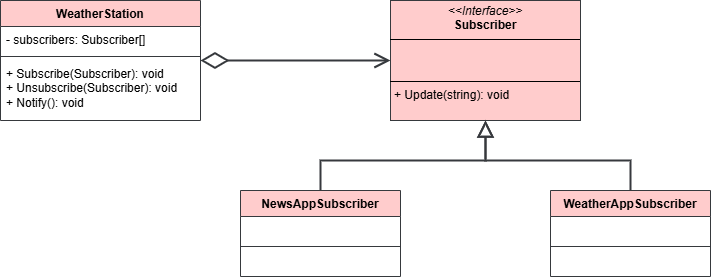

 # Observer Pattern

This project demonstrates the implementation of the Observer design pattern within the `src` folder. 
The Observer design pattern is a behavioral design pattern that allows objects to subscribe to a subject and be notified when the subject changes.

## UML Class Diagram

The UML class diagram for the Observer pattern is shown below:

## Source Code

The `src` folder contains the implementation of the Observer pattern. The key components include:

- **Subscriber**: An abstract class or interface that defines the interface for the concrete subscribers. Abstraction used by the Publisher. Get notified by the publisher.
- **NewsAppSubscriber**, **WeatherAppSubscriber**: Concrete implementations of the Subscriber abstract base class. Services.
- **WeatherStation**: Stands for publisher, notifies subscribers.

Explore the `src` folder to see how each of these components has been implemented.
