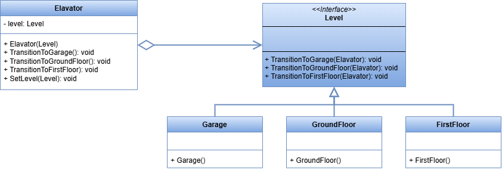

 # State Pattern

This project demonstrates the implementation of the State design pattern within the `src` folder. 
The State design pattern is a behavioral design pattern that allows objects to change their behavior based on their state.

## UML Class Diagram

The UML class diagram for the State pattern is shown below:

## Source Code

The `src` folder contains the implementation of the State pattern. The key components include:

- **Elavator**: A class that contains the context.
- **Level**: An abstract class or interface that defines the interface for the concrete levels. Also interface for each state.
- **GroundFloor**, **FirstFloor**, **Garage**: Concrete implementations of the Level interface.

Explore the `src` folder to see how each of these components has been implemented.
