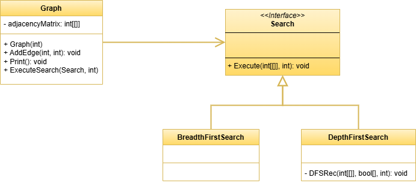

 # Strategy Pattern

This project demonstrates the implementation of the Strategy design pattern within the `src` folder. 
The Strategy design pattern is a behavioral design pattern that allows you to define a family of algorithms, encapsulate each one, and make them interchangeable.

## UML Class Diagram

The UML class diagram for the Strategy pattern is shown below:

## Source Code

The `src` folder contains the implementation of the Strategy pattern. The key components include:

- **Graph**: Represents the Context class of the Strategy design pattern. Calls the Search interface.
- **Search**: An interface that defines the operations that can be performed on different search algorithms. Represents the Strategy class of the Strategy design pattern.
- **BreadthFirstSearch**, **DepthFirstSearch**: Concrete implementations of the Search interface that represent different search algorithms.

Explore the `src` folder to see how each of these components has been implemented.
