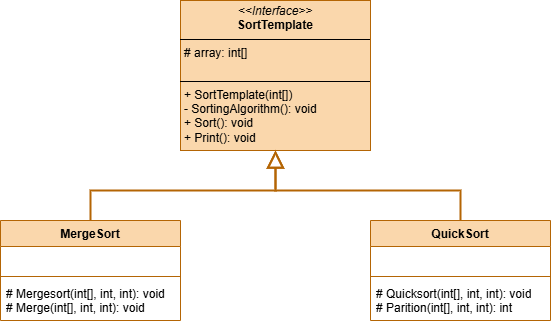

 # Template Method Pattern

This project demonstrates the implementation of the Template Method design pattern within the `src` folder. 
The Template Method design pattern is a behavioral design pattern that defines the skeleton of an algorithm in an abstract class, 
and allows subclasses to override specific steps of the algorithm without changing the overall structure.

## UML Class Diagram

The UML class diagram for the Template Method pattern is shown below:

## Source Code

The `src` folder contains the implementation of the Template Method pattern. The key components include:

- **SortTemplate**: An abstract class or interface that defines the interface for the concrete classes that implement the Template Method design pattern. Contains abstract methods and the template method.
- **QuickSort**, **MergeSort**: Concrete implementations of the SortTemplate abstract base class.

Explore the `src` folder to see how each of these components has been implemented.
