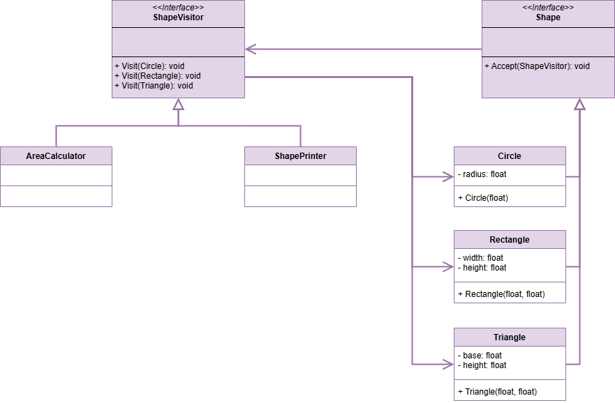

 # Visitor Pattern

This project demonstrates the implementation of the Visitor design pattern within the `src` folder. 
The Visitor design pattern is a behavioral design pattern that allows objects to be visited by other objects. 
This pattern is useful when you want to perform operations on objects that are not part of a hierarchy.

## UML Class Diagram

The UML class diagram for the Visitor pattern is shown below:

## Source Code

The `src` folder contains the implementation of the Template Method pattern. The key components include:

- **Shape**: An abstract class or interface that defines the interface for the concrete classes that implement the Visitor design pattern. Contains abstract methods and the template method.
- **Circle**, **Rectangle**, **Triangle**: Concrete implementations of the Shape abstract base class.
- **ShapeVisitor**: An abstract class or interface that defines the interface for the concrete classes that implement the Visitor design pattern. Contains abstract methods and the template method.
- **AreaCalculator**, **ShapePrinter**: Concrete implementations of the ShapeVisitor abstract base class.

Explore the `src` folder to see how each of these components has been implemented.
