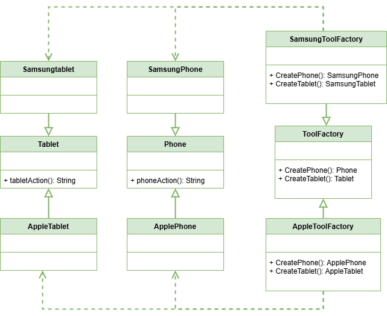

 # Abstract Factory Pattern

This project demonstrates the implementation of the Abstract Factory design pattern within the `src` folder. 
The Abstract Factory pattern is a creational design pattern that provides a way to create objects without specifying their concrete classes. 

## UML Class Diagram

The UML class diagram for the Abstract Factory pattern is shown below:

## Source Code

The `src` folder contains the implementation of the Abstract Factory pattern. The key components include:

- `ToolFactory.hpp`: The `ToolFactory` class is an abstract factory class that provides methods to create objects of classes `Tablet` and `Phone`.
- `AppleToolFactory.hpp`: The `AppleToolFactory` class is a concrete factory class that creates objects of classes `AppleTablet` and `ApplePhone`.
- `SamsungToolFactory.hpp`: The `SamsungToolFactory` class is a concrete factory class that creates objects of classes `SamsungTablet` and `SamsungPhone`.

Explore the `src` folder to see how each of these components has been implemented.
