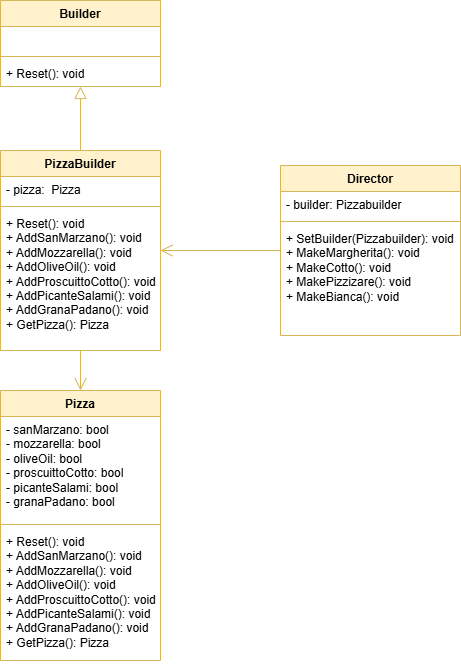

 # Builder Pattern

This project demonstrates the implementation of the Builder design pattern within the `src` folder. 
The Builder design pattern is a creational design pattern that provides a way to construct complex objects by
combining simpler objects.

## UML Class Diagram

The UML class diagram for the Builder pattern is shown below:

## Source Code

The `src` folder contains the implementation of the Builder pattern. The key components include:

- **Builder**: An abstract class or interface defining the builder.
- **Director**: A class that provides methods to create objects of class Pizza by using the methods of class PizzaBuilder.
- **PizzaBuilder**: A concrete builder class that implements the Builder interface.
- **Pizza**: A class that represents the object being constructed.

Explore the `src` folder to see how each of these components has been implemented.
