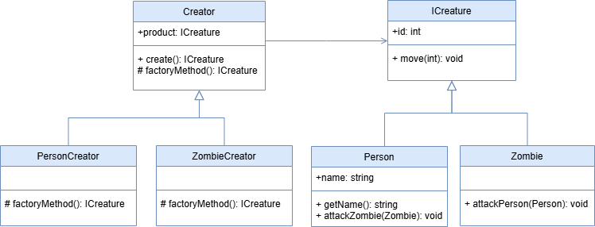

 # Factory Method Pattern

This project demonstrates the implementation of the Factory Method design pattern within the `src` folder. The Factory Method pattern is a creational design pattern that provides an interface for creating objects in a superclass but allows subclasses to alter the type of objects that will be created.

## UML Class Diagram

The UML class diagram illustrating the Factory Method implementation can be found below:

## Source Code

The `src` folder contains the implementation of the Factory Method pattern. The key components include:

- **Creator**: An abstract class or interface defining the factory method.
- **PersonCreator**: Subclasses that override the factory method to produce Person type of objects.
- **ZombieCreator**: Subclasses that override the factory method to produce Zombie type of objects.
- **ICreature**: An interface or abstract class defining the objects the factory method creates.
- **Person**: Various implementations of the ICreature interface.
- **Zombie**: Various implementations of the ICreature interface.

Explore the `src` folder to see how each of these components has been implemented.
