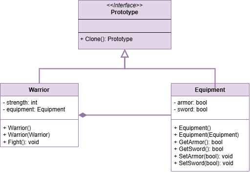

 # Prototype Pattern

This project demonstrates the implementation of the Prototype design pattern within the `src` folder. 
The Prototype design pattern is a creational design pattern that provides a way to create objects in a
superclass and clone them using a subclass.

## UML Class Diagram

The UML class diagram for the Prototype pattern is shown below:

## Source Code

The `src` folder contains the implementation of the Prototype pattern. The key components include:

- **Prototype**: An abstract base class that defines the interface for all classes that implement the Prototype design pattern.
- **Warrior**: A concrete implementation of the Prototype abstract base class.
- **Equipment**: A concrete implementation of the Prototype abstract base class.

Explore the `src` folder to see how each of these components has been implemented.
