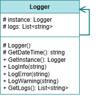

 # Singleton Pattern

This project demonstrates the implementation of the Singleton design pattern within the `src` folder. 
The Singleton design pattern is a creational design pattern that provides a way to create a singleton object.
The singleton object is created only once and is shared by all its subclasses.

## UML Class Diagram

The UML class diagram for the Singleton pattern is shown below:

## Source Code

The `src` folder contains the implementation of the Singleton pattern. The key components include:

- **Logger**: A class that provides a logger functionality. Represents the Singleton class.

Explore the `src` folder to see how each of these components has been implemented.
