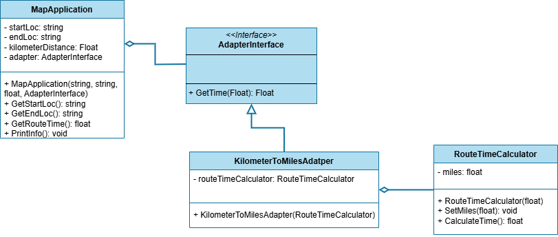

 # Adapter Pattern

This project demonstrates the implementation of the Adapter design pattern within the `src` folder. 
The Singleton design pattern is a structural design pattern that provides a way to convert one interface into another. Allowing the two objects to work together.

## UML Class Diagram

The UML class diagram for the Adapter pattern is shown below:

## Source Code

The `src` folder contains the implementation of the Adapter pattern. The key components include:

- **AdapterInterface**: An abstract class or interface that defines the interface for the target class.
- **KilometerToMilesAdapter**: A concrete implementation of the AdapterInterface that converts kilometer distances to miles.
- **RouteTimeCalculator**: A class that provides a method to calculate travel time based on distance. Service object.
- **MapApplication**: A class uses the AdapterInterface to get the travel time.

Explore the `src` folder to see how each of these components has been implemented.
