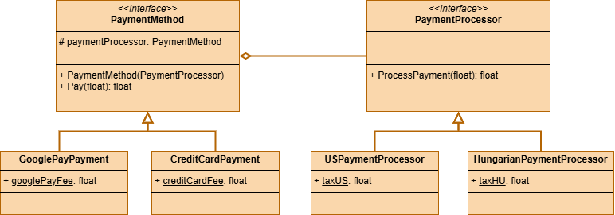

 # Bridge Pattern

This project demonstrates the implementation of the Bridge design pattern within the `src` folder. 
The Bridge design pattern is a structural design pattern that divides business logic or huge class into separate class hierarchies that can be developed independently.

## UML Class Diagram

The UML class diagram for the Bridge pattern is shown below:

## Source Code

The `src` folder contains the implementation of the Bridge pattern. The key components include:

- **PaymentMethod**: An abstract class or interface that defines the interface for the target class. Abstraction used by the client.
- **CreditCardPayment**: A concrete implementation of the PaymentMethod that handles credit card payments.
- **GooglePayPayment**: A concrete implementation of the PaymentMethod that handles Google Pay payments.
- **PaymentProcessor**: A class that provides a method to process payments. Stands for the mplementation interface.
- **HungarianPaymentProcessor**: A concrete implementation of the PaymentProcessor that processes Hungarian payments.
- **USPaymentProcessor**: A concrete implementation of the PaymentProcessor that processes US payments.

Explore the `src` folder to see how each of these components has been implemented.
