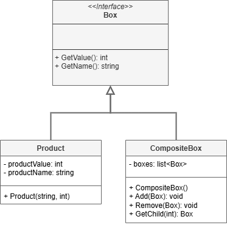

 # Composite Pattern

This project demonstrates the implementation of the Composite design pattern within the `src` folder. 
The Composite design pattern is a structural design pattern that lets you compose objects into tree structures and then work with these structures as if they were individual objects.

## UML Class Diagram

The UML class diagram for the Composite pattern is shown below:

## Source Code

The `src` folder contains the implementation of the Composite pattern. The key components include:

- **Box**: An abstract class or interface that defines the interface for the target class. Represents the Component class of the Composite design pattern.
- **CompositeBox**: A concrete implementation of the Box interface that represents the Composite class of the Composite design pattern.
- **ProductBox**: A concrete implementation of the Box interface that represents the Leaf class of the Composite design pattern.

Explore the `src` folder to see how each of these components has been implemented.
