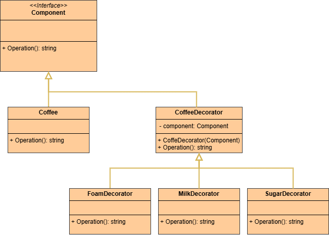

 # Decorator Pattern

This project demonstrates the implementation of the Decorator design pattern within the `src` folder. 
The Decorator design pattern is a structural design pattern that allows adding new behaviors to objects dynamically by placing them inside special wrapper objects, called decorators.

## UML Class Diagram

The UML class diagram for the Decorator pattern is shown below:

## Source Code

The `src` folder contains the implementation of the Decorator pattern. The key components include:

- **Component**: An abstract class or interface that defines the interface for the target class. Represents the Component class of the Decorator design pattern.
- **Coffee**: A concrete implementation of the Component interface that represents the ConcreteComponent class of the Decorator design pattern.
- **CoffeeDecorator**: A concrete implementation of the Component interface that represents the Base Decorator class of the Decorator design pattern.
- **MilkDecorator**: A concrete implementation of the Base Decorator interface that represents a concrete decorator class of the Decorator design pattern.
- **FoamDecorator**: A concrete implementation of the Base Decorator interface that represents a concrete decorator class of the Decorator design pattern.
- **SugarDecorator**: A concrete implementation of the Base Decorator interface that represents a concrete decorator class of the Decorator design pattern.

Explore the `src` folder to see how each of these components has been implemented.
