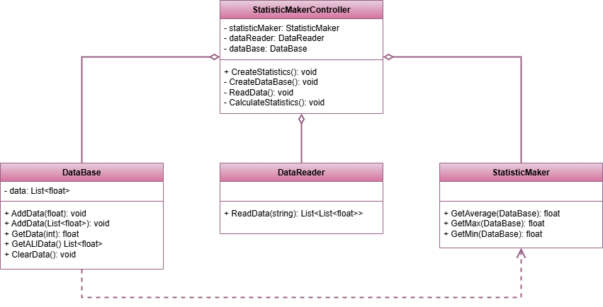

 # Facade Pattern

This project demonstrates the implementation of the Facade design pattern within the `src` folder. 
The Facade design pattern is a structural design pattern that provides a simplified (but limited) interface to a complex system of classes, library or framework.

## UML Class Diagram

The UML class diagram for the Facade pattern is shown below:

## Source Code

The `src` folder contains the implementation of the Facade pattern. The key components include:

- **StatisticMakerController**: A class represents the Facade class of the Facade design pattern.
- **DataBase**, **StatisticMaker**, **DataReader**: classes represent a Service classes of the Facade design pattern.

Explore the `src` folder to see how each of these components has been implemented.
