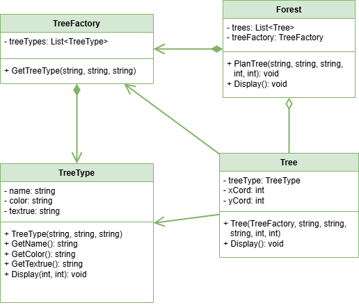

 # Flyweight Pattern

This project demonstrates the implementation of the Flyweight design pattern within the `src` folder. 
The Flyweight design pattern is a structural design pattern that allows sharing of objects between multiple contexts, reducing memory usage and improving performance.

## UML Class Diagram

The UML class diagram for the Flyweight pattern is shown below:

## Source Code

The `src` folder contains the implementation of the Flyweight pattern. The key components include:

- **TreeType**: A class that contains the data associated with a tree type. Saves memory by reusing the same data for multiple trees (Flyweight object).
- **TreeFactory**: A class that creates and manages the TreeType objects (Flyweight factory).
- **Tree**: A class that represents a tree and references a TreeType object. The context.
- **Forest**: A class that represents a collection of trees and uses the TreeFactory to create and manage the TreeType objects.

Explore the `src` folder to see how each of these components has been implemented.
