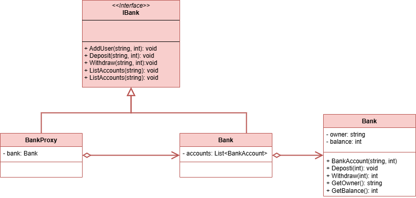

 # Proxy Pattern

This project demonstrates the implementation of the Proxy design pattern within the `src` folder. 
The Proxy design pattern is a structural design pattern that provides an object that acts as a substitute for a real service object used by a client. A proxy receives client requests, does some work (access control, caching, etc.) and then passes the request to a service object.

## UML Class Diagram

The UML class diagram for the Proxy pattern is shown below:

## Source Code

The `src` folder contains the implementation of the Proxy pattern. The key components include:

- **IBank**: An interface that defines the operations that can be performed on a both bank and proxy objects. Represents the Service interface class of the Proxy design pattern.
- **Bank**: A class that implements the IBank interface and represents the Service class of the Proxy design pattern.
- **BankProxy**: A class that implements the IBank interface and represents the Proxy class of the Proxy design pattern.

Explore the `src` folder to see how each of these components has been implemented.
